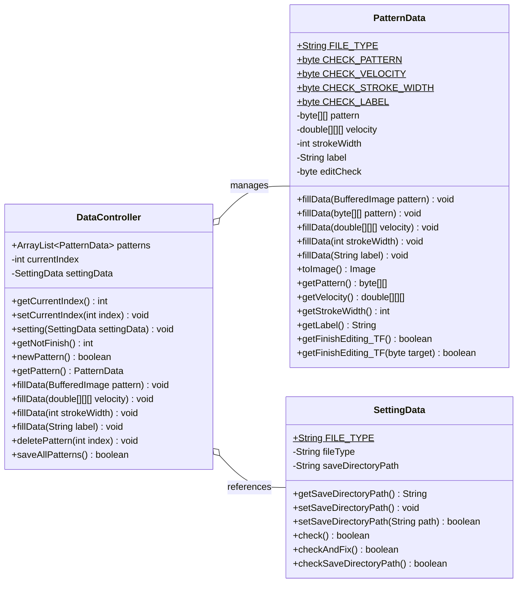
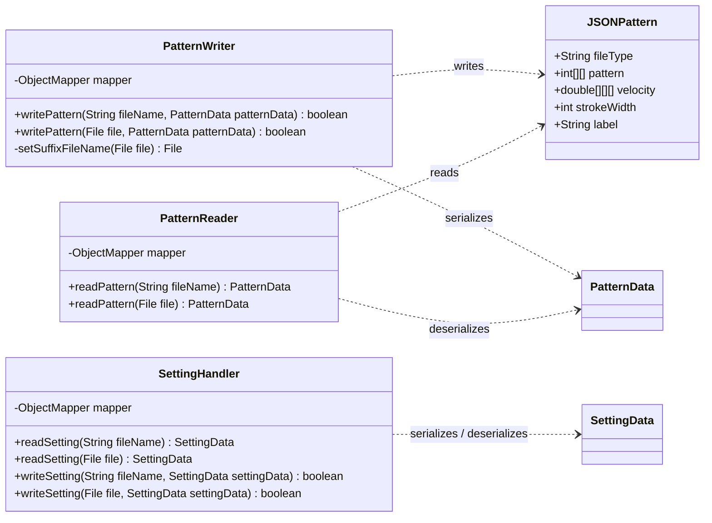
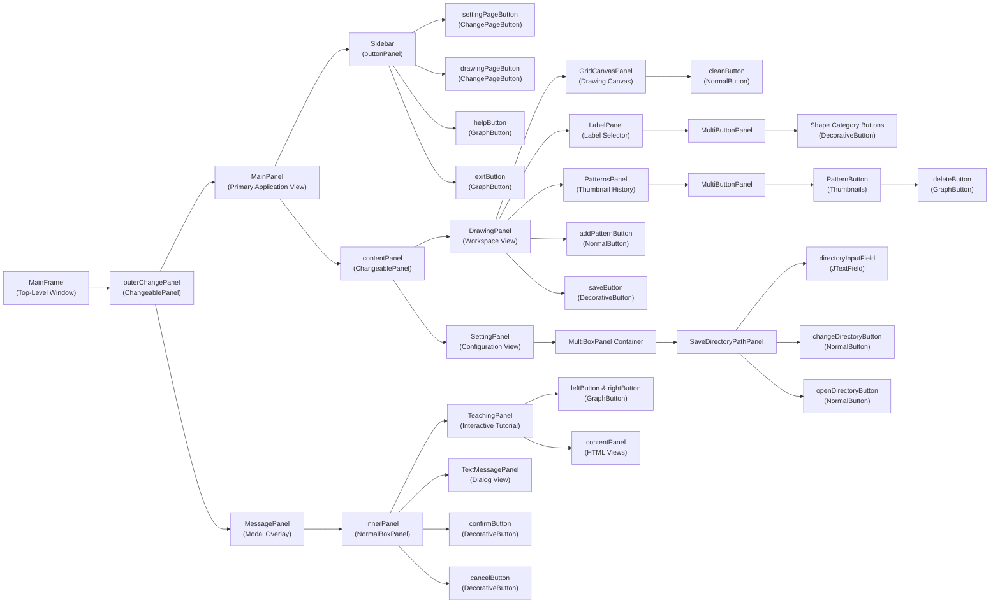

# Pattern Dataset Collection & Visualization Tools

**`Author: IalvinchangI`**

This repository provides standalone tools to create, collect, and inspect hand-drawn geometric pattern datasets for pattern recognition models. It is designed to capture multimodal shape data—including both spatial $64 \times 64$ pixel grids and real-time pen movement velocities.

The project comprises two independent components:
- **`PatternRecognitionApp`**: A desktop application (Java Swing) used to draw, annotate, and collect geometric shape patterns along with pen movement speed from contributors. The taxonomy is fully configurable—new label categories and numerical mappings can easily be added by modifying `label2code.json` and rebuilding the app.
- **`Visualize`**: A lightweight Python tool for reading, verifying, and plotting collected `.iai` data files. It allows users to visually inspect shapes and velocity heatmaps from the CLI, and provides a reader script (`ReadPattern.py`) to easily load saved patterns for machine learning model training.

This is a preparatory project dedicated to collecting and inspecting dataset samples, laying the groundwork for subsequent shape classification and pattern recognition tasks.

<br>

## Overview

```text
├── Visualize/                           # Python visualization and data inspection module
│   ├── ReadPattern.py                   # Python module for reading .iai pattern files
│   └── ShowPattern.py                   # CLI tool to plot and visualize patterns & velocities
│
└── PatternRecognitionApp/               # Java Swing dataset creation and annotation app
    └── src/main/
        ├── resources/                   # Assets, icons, and configuration files
        │   ├── label2code.json          # Mapping from geometric shape labels to numeric codes
        │   └── images/                  # Application UI icons and shape preview images
        │
        └── java/indi/IalvinchangI/patternrecognitionapp/
            ├── App.java                 # Application main entry point
            ├── ResourceConstant.java    # Resource path constants
            ├── data/                    # Data structures and dataset controller
            ├── io/                      # JSON serialization and file handlers
            ├── util/                    # Mathematical and data structure utilities
            └── gui/                     # Swing graphical interface components
                ├── MainFrame.java       # Top-level window frame
                ├── TeachingPanel.java   # Interactive user manual / tutorial modal
                ├── main/                # Navigation sidebar and page containers
                ├── drawing/             # Drawing canvas, labeling, and pattern management
                ├── message/             # Modal dialogs and blurred background overlays
                ├── setting/             # Configuration and folder selection screens
                └── tools/               # Reusable UI primitives, buttons, and custom panels
```

- **`Visualize/`**: Python-based visualization suite designed to load exported pattern files (`.iai`), compute velocity magnitude norms, and render visual grids of shapes and pen dynamics using Matplotlib and NumPy.
- **`PatternRecognitionApp/`**: Java desktop application built with Swing to facilitate drawing, annotating, managing, and exporting dataset samples of geometric shapes with single-stroke pen dynamics.
    - **`src/main/resources/`**: Static application assets including UI icon images, shape reference graphics, and `label2code.json` label mappings.
    - **`data/`**: Core data models representing raw pixel grids, velocity matrices, stroke thickness, labels, and the collection controller.
    - **`io/`**: I/O serialization handlers interfacing between internal Java models and `.iai` / JSON representations via Jackson Databind.
    - **`util/`**: Low-level utility classes for time-based velocity calculations and bounded capacity collections.
    - **`gui/`**: View hierarchy, including custom interactive drawing canvases, modal messaging overlays, navigation sidebars, and customizable Swing UI components.


<br>
<br>
<br>


## Pattern Recognition App

**PatternRecognitionApp** is a desktop application designed to create, label, and export training datasets for geometric pattern recognition models. It provides a straightforward interface to collect hand-drawn shapes and pen stroke movement velocities from contributors.

### Key Highlights & Data Modalities
- **Dual-Modality Capture**:
  1. **Visual Graphic Matrix**: A $64 \times 64$ grayscale pixel matrix drawn by the user in a single continuous stroke.
  2. **Pen Movement Dynamics**: Real-time $(v_x, v_y)$ pen velocity vectors measured at each coordinate point during drawing.
- **Configurable & Extensible Taxonomy**: Shape categories, preview icons, and numeric code mappings are managed via [`label2code.json`](./PatternRecognitionApp/src/main/resources/label2code.json). Adding or updating labels requires only updating this JSON file and rebuilding the package.
- **Batch Session Management**: Supports drawing multiple shapes per session, reviewing thumbnail histories, re-editing incomplete entries, and exporting validated items as structured `.iai` JSON files.


### Core Data Architecture & Serialization

The Non-GUI core is divided into two primary subsystems: the in-memory **Data Layer** (handling the pattern data models, validation state bitmasks, and controller logic) and the **I/O & Serialization Layer** (responsible for disk persistence and Jackson JSON transformations).

> [!NOTE]
> The following class diagrams highlight crucial domain attributes, state flags, and primary public APIs essential to system architecture. Standard boilerplate (such as internal Swing repaint delegates, constructor overloads, and simple accessor pairs) is condensed to maintain visual clarity.

#### 1. Data Layer (`data`)
Manages in-memory pattern representations, bitmask validation flags, configuration persistence data, and session-wide dataset batch operations.



#### 2. I/O & Serialization Layer (`io`)
Handles file persistence and deserialization of pattern datasets and application configuration via Jackson's `ObjectMapper`.



<br>

### Custom UI Controls & Base Panels (GUI Tools & Component Hierarchy)

The application utilizes a modular GUI hierarchy where specialized views, buttons, and dialogs inherit from custom foundational primitives defined in `gui.tools`. 

> [!NOTE]
> The diagram below illustrates the complete inheritance structure, showing how application-specific GUI components (such as `DrawingPanel`, `SettingPanel`, `LabelPanel`, and `MessagePanel`) extend the reusable button and panel primitives provided by `gui.tools`.

```mermaid
classDiagram
    direction LR
    
    %% Base Button Hierarchy
    class EditableButton {
        <<abstract>>
        +boolean canSelectTF
        +select() void
        +deselect() void
        #paintComponentSetting(Graphics2D g2d)* void
        #paintComponentBackground(Graphics2D g2d)* void
        #paintComponentContent(Graphics2D g2d) void
    }

    class GraphButton {
        #Image icon
        #int width
        #int height
        +setAbsoluteSize(Dimension size) void
        +setIconMargin(int margin) void
        +setIcon(Image image) void
        +setIcon(String resourcePath) void
    }

    class NormalButton {
        +Color buttonColor
        +Color borderColor
        +Color selectedBorderColor
        +Color hoveredBorderColor
        +int arcDiameter
    }

    class DecorativeButton {
        -byte animationStep
        -Timer animationTimer
        +Color buttonColor
        +Color ringColor
        +Color selectedRingColor
        +int arcDiameter
    }

    class ChangePageButton {
        +Color buttonColor
        +Color selectedButtonColor
        +setWidth(int height) void
    }

    class PatternButton {
        -PatternData pattern
        -GraphButton deleteButton
        +reloadPattern() void
    }

    %% Base Panel Hierarchy
    class TransparentPanel {
    }

    class BoxPanel {
        <<abstract>>
        +float alpha
        +Color boxColor
        +Color borderColor
        #paintComponentSetting(Graphics2D g2d)* void
        #paintComponentBackground(Graphics2D g2d)* void
        #paintComponentContent(Graphics2D g2d) void
    }

    class NormalBoxPanel {
        +int arcDiameter
    }

    class CenteredComponentPanel {
        #Component comp
    }

    class ChangeablePanel {
        -ArrayList~String~ pageNames
        -String currentPage
        +getPageNames() ArrayList~String~
        +getCurrentPage() String
        +showPage(String pageName) boolean
        +add(Component comp, String pageName) void
        +createChangePagePerformed(String pageName) ActionListener
    }

    class MultiBoxPanel {
        +int X_AXIS$
        +int Y_AXIS$
        -int sep
        -ArrayList~BoxPanel~ panels
        +getPanelCount() int
        +getPanel(int index) BoxPanel
        +addPanel(BoxPanel panel) void
    }

    class MultiButtonPanel {
        +int X_AXIS$
        +int Y_AXIS$
        -int sep
        -ButtonGroup buttonGroup
        -ArrayList~EditableButton~ buttons
        -AutoDropQueue~EditableButton~ previousSelectedButton
        +getButtonCount() int
        +getButton(int index) EditableButton
        +getCurrentSelectedButton() EditableButton
        +getPreviousSelectedButton() EditableButton
        +contains(EditableButton button) boolean
        +indexOf(EditableButton button) int
        +addButton(EditableButton button) void
        +setSelected(EditableButton button, boolean selected_TF) boolean
        +clearSelection() void
        +deleteButton(int buttonIndex) void
        +deleteAllButton() void
    }

    class NormalScrollPanel {
        +int MARGIN$
        +int SCROLL_BAR_WIDTH$
        -JScrollPane scrollPanel
        #addComponent(Component view) void
        +setVerticalScrollBarPolicy(int policy) void
        +setHorizontalScrollBarPolicy(int policy) void
        +setVerticalValue(int verticalValue) void
        +setHorizontalValue(int horizontalValue) void
        +toEnd() void
    }

    %% Application GUI Components
    class MainPanel {
        +ChangeablePanel contentPanel
        -TransparentPanel buttonPanel
        -ChangePageButton settingPageButton
        -ChangePageButton drawingPageButton
        -GraphButton helpButton
        -GraphButton exitButton
        -SettingPanel settingPanel
        -DrawingPanel drawingPanel
        +String SETTING_PAGE_NAME$
        +String DRAWING_PAGE_NAME$
    }

    class DrawingPanel {
        ~DataController dataController
        ~GridCanvasPanel canvas
        ~LabelPanel labelPanel
        ~PatternsPanel patterns
        -NormalButton addPatternButton
        -DecorativeButton saveButton
        +deleteButton(int index) void
        +changeEditingPattern(int index, boolean manualSelectTF) void
    }

    class GridCanvasPanel {
        +int GRID_COUNT$
        +int GRID_WIDTH$
        +int STROKE_WIDTH$
        -NormalButton cleanButton
        -double[][][] velocity
        -BufferedImage drawingPattern
        -byte emptyCheck
        +clearCanvas() void
        +laodPattern(PatternData pattern) void
    }

    class LabelPanel {
        -MultiButtonPanel buttonPanel
        -HashMap~String, GraphButton~ buttons
        +addButton(LabelToCode l2c) void
        +loadLabel(PatternData pattern) void
        +clearSelection() void
    }

    class PatternsPanel {
        +int BUTTON_WIDTH$
        -DrawingPanel drawingPanel
        -MultiButtonPanel buttonPanel
        +getButtonCount() int
        +getButton(int index) PatternButton
        +getPreviousSelectedButton() PatternButton
        +addPattern(PatternData pattern) void
        +deleteButton(int index) void
        +deleteAllButton() void
    }

    class SettingPanel {
        -MultiBoxPanel panelsPanel
    }

    class SaveDirectoryPathPanel {
        -JLabel label
        -JTextField directoryInputField
        -NormalButton changeDirectoryButton
        -NormalButton openDirectoryButton
        +setDirectoryPath(String path) void
    }

    class MessagePanel {
        -NormalBoxPanel innerPanel
        -DecorativeButton confirmButton
        -DecorativeButton cancelButton
        -ShowableMessagePanel currentMessage
        +showMessage(ShowableMessagePanel message) void
        +closeMessage() void
    }

    class ShowableMessagePanel {
        <<abstract>>
        +int DEFAULT_MESSAGE$
        +int CONFIRM_MESSAGE$
        #int messageType
        +getMessageType()* int
        #setBackgroundColor(Color color)* void
        #clickConfirm() void
        #clickCancel() void
        #closeMessage()* void
    }

    class TeachingPanel {
        +int TEACH_ALL$
        +int DESCRIPTION$
        +int TEACH_DRAWING$
        +int TEACH_SETTING$
        -ChangeablePanel contentPanel
        -GraphButton leftButton
        -GraphButton rightButton
        +setContent(int content) void
    }

    class TextMessagePanel {
        +setMessageType(int messageType) void
        +closeMessage() void
    }

    %% Inheritances
    EditableButton <|-- GraphButton
    GraphButton <|-- NormalButton
    GraphButton <|-- DecorativeButton
    GraphButton <|-- ChangePageButton
    NormalButton <|-- PatternButton

    TransparentPanel <|-- BoxPanel
    BoxPanel <|-- NormalBoxPanel
    NormalBoxPanel <|-- SaveDirectoryPathPanel

    TransparentPanel <|-- CenteredComponentPanel
    CenteredComponentPanel <|-- MessagePanel

    TransparentPanel <|-- ChangeablePanel
    TransparentPanel <|-- MultiBoxPanel
    TransparentPanel <|-- MultiButtonPanel

    TransparentPanel <|-- NormalScrollPanel
    NormalScrollPanel <|-- LabelPanel
    NormalScrollPanel <|-- PatternsPanel
    NormalScrollPanel <|-- SettingPanel

    TransparentPanel <|-- ShowableMessagePanel
    ShowableMessagePanel <|-- TeachingPanel
    ShowableMessagePanel <|-- TextMessagePanel

    TransparentPanel <|-- MainPanel
    TransparentPanel <|-- DrawingPanel
    TransparentPanel <|-- GridCanvasPanel
```



<br>

### GUI Component Hierarchy & View Containment

The user interface follows a nested containment hierarchy built upon Swing containers. The flowchart below illustrates how windows, panels, canvases, and controls are organized and nested inside each other at runtime:



<br>

### Helper Classes & Utility Methods

The project includes several stateless utilities, helper classes, and constant interfaces that provide mathematical calculations, resource loading, UI theming, and queue data structures across components.

#### 1. `GUITools` (`indi.IalvinchangI.patternrecognitionapp.gui.tools.GUITools`)
Static helper utilities for image scaling, resource stream extraction, and Swing event bubbling.

- `getScaledImage(Image image, int width, int height) -> Image`: Scales a `java.awt.Image` to the specified dimensions using `Image.SCALE_SMOOTH`.
- `getScaledImageFromResource(String resourcePath, int width, int height) -> Image`: Loads an image from the classpath resource stream and returns it resized.
- `getScaledImageIconFromResource(String resourcePath, int width, int height) -> ImageIcon`: Loads and rescales a classpath image, wrapping it in an `ImageIcon`.
- `getImageFromResource(String resourcePath) -> Image`: Directly reads an image from an internal resource stream via `ImageIO.read()`.
- `addEventBubbling(Component comp) -> Component`: Attaches mouse listeners to a component to forward (`dispatchEvent`) mouse clicks, presses, releases, drags, and wheel movements up to its parent container.

#### 2. `MotionCalculator` (`indi.IalvinchangI.patternrecognitionapp.util.MotionCalculator`)
Mathematical utility for calculating stroke motion dynamics and pen speed.

- `velocity(double startX, double endX, long startTime, long endTime) -> double`: Computes 1D linear velocity using $\frac{\Delta x}{\Delta t} = \frac{\text{endX} - \text{startX}}{\text{endTime} - \text{startTime}}$ (pixels/ms).
- `velocity(double[] startPos, double[] endPos, long startTime, long endTime) -> double[]`: Computes 2D velocity vector $[v_x, v_y]$ from coordinate arrays over a time interval.
- `getCurrentTime() -> long`: Returns current epoch timestamp in milliseconds via `System.currentTimeMillis()`.

#### 3. `ResourceConstant` (`indi.IalvinchangI.patternrecognitionapp.ResourceConstant`)
Central registry for application assets, icon filenames, and resource path formatting.

- `getResourcePath(String target) -> String`: Prepends the root resource path prefix to the target resource identifier.
- `getImagePath(String target) -> String`: Resolves the absolute classpath location for an image located under `images/`.

#### 4. `AutoDropQueue<E>` (`indi.IalvinchangI.patternrecognitionapp.util.AutoDropQueue`)
Bounded-capacity FIFO sliding queue used for tracking button selection histories and state transitions.

- `AutoDropQueue(int capacity)`: Initializes a queue with a maximum element capacity.
- `add(E element) -> E`: Adds a new element to the head; if capacity is exceeded, automatically drops and returns the oldest tail element.
- `get(int index) -> E`: Retrieves the element stored at the specified index.
- `peekNewest() -> E`: Returns the newest element (head) without removing it.
- `peek() -> E`: Returns the oldest element (tail) without removing it.
- `clear() -> void`: Empties all elements from the queue.
- `isFull() -> boolean`: Checks if the queue has reached its maximum capacity.
- `size() -> int`: Returns the current number of elements in the queue.

#### 5. `GUIConstant` (`indi.IalvinchangI.patternrecognitionapp.gui.tools.GUIConstant`)
Global UI interface defining color schemes, fonts, and window bounds.

- `MIN_WINDOW_WIDTH` ($900\text{px}$) & `MIN_WINDOW_HEIGHT` ($700\text{px}$): Minimum application window boundaries.
- `PRIMARY_BACKGROUND_COLOR`, `SECONDARY_BACKGROUND_COLOR`, `LIGHT_COLOR`, `BRIGHT_COLOR`, `DARK_COLOR`, `PRIMARY_BOX_COLOR`, `SECONDARY_BOX_COLOR`: Theme color palette definitions.
- `SUBTITLE_FONT` & `CONTENT_FONT`: Typography specifications for headers and body content.

#### 6. `LabelToCode` (`indi.IalvinchangI.patternrecognitionapp.io.LabelToCode`)
Helper class and JSON parser for geometric label mapping configurations.

- `readFromJsonResource(String resourcePath) -> LabelToCode[]`: Static JSON parser reading `label2code.json` into an array of mapping descriptors.
- `getImage() -> Image`: Resolves and loads the corresponding reference geometric icon image.

<br>

### Application Usage & Operation Guide

#### 1. Drawing Page (`繪圖頁面`)
The Drawing page is the primary workspace for producing and annotating single-stroke pattern samples:
- **Canvas (Left $64 \times 64$ Grid)**:
  - Draw your target geometric shape on the grid canvas.
  - **Single-Stroke Rule**: Shapes must be drawn in **one continuous stroke** without releasing the left mouse button.
  - Pixel coverage and continuous pen velocities $(v_x, v_y)$ are recorded in real-time.
  - Click the **Brush/Clean** button in the lower-right corner of the canvas to reset the active drawing.
- **Label Selector (Right Panel)**:
  - Select the appropriate label from the scrollable list (e.g., Circle, Triangle, Square, Pentagon, Pentagram, Hexagon, Heptagon, Heptagram, Octagon).
- **Pattern History List (Bottom Row)**:
  - Displays thumbnail previews of all shapes drawn in the current session.
  - Click any thumbnail button to switch back to that pattern and edit its drawing or label.
  - Click the small **X** (delete) button on a thumbnail to remove that pattern.
- **New Pattern Button (`+`)**:
  - Click the **`+`** button to create a new blank pattern.
  - *Note*: If the current pattern is incomplete (either missing a drawing or missing a label), the app will display a warning dialog prompting you to finish it first.
- **Save Button (Floppy Disk Icon)**:
  - Once all patterns are completed, click the Save button.
  - The app validates all entries and exports each completed item as a `.iai` file to the configured save directory.
  - After saving, the session list is cleared, ready for new entries.

#### 2. Setting Page (`設定頁面`)
- **Save Location (`儲存位置`)**:
  - View the active export destination path.
  - Click the **Folder icon button** to open a directory chooser and select a new destination folder.
  - Click the **Pointer/Arrow icon button** to open the current save folder directly in your operating system's native file manager.

#### 3. Navigation, Help & Exit
- **Sidebar**: Switch between the **Drawing Page** and **Setting Page** using the left navigation buttons.
- **Help Button (`?`)**: Opens the interactive multi-page tutorial modal (Introduction, Drawing Guide, Settings Guide).
- **Exit Button**: Saves current configuration to `setting.iai` and closes the application.

<br>

### Build Instructions & Dependency Setup

#### Prerequisites
- **Java Development Kit (JDK)**: Version 18 or higher.
- **Apache Maven**: Version 3.6 or higher.

#### Required Dependencies
Configured in `pom.xml`:
- `com.fasterxml.jackson.core:jackson-databind` (v2.17.2): For reading and writing `.iai` / JSON pattern files.
- `junit:junit` (v3.8.1): Testing framework.
- `maven-assembly-plugin`: Bundles the application into an executable Fat JAR (`jar-with-dependencies`).

#### Build Steps

1. Navigate to the `PatternRecognitionApp` project folder:
   ```bash
   cd PatternRecognitionApp
   ```

2. Build the project and package the fat JAR:
   ```bash
   mvn clean package
   ```

3. Locate and run the generated JAR:
   ```bash
   java -jar target/PatternRecognitionApp-1.0.0-jar-with-dependencies.jar
   ```


<br>
<br>
<br>


## Visualization

The **Visualization** module provides Python tools to inspect, verify, and visualize pattern datasets produced by the `PatternRecognitionApp`.

### Purpose & Downstream Training Integration
- **Dataset Verification & Quality Assurance**: Quickly load and inspect collected `.iai` files to verify that visual shapes and recorded pen velocities are free of anomalies before model training.
- **Dual-Modality Multi-Sample Plotting**: Utilizes **Matplotlib** and **NumPy** to render:
  - **Pattern Plot**: Grayscale $64 \times 64$ raster image matrices annotated with their shape class labels.
  - **Velocity Plot**: Euclidean velocity magnitude heatmaps ($\|\vec{v}\| = \sqrt{v_x^2 + v_y^2}$), visualizing pen stroke movement speed across coordinates.
- **Dataset Loader for Training**: Built-in [`ReadPattern.py`](./Visualize/ReadPattern.py) (`PatternReader`) functions as an out-of-the-box Python generator/iterator to easily load `.iai` samples directly in training scripts.

<br>

### Python Environment Setup & Dependency Installation

#### Prerequisites
- **Python**: Version 3.8 or higher.

#### Setup Virtual Environment

1. Navigate to the `Visualize` folder:
   ```bash
   cd Visualize
   ```

2. Create a virtual environment:
   ```bash
   # Linux / macOS
   python3 -m venv venv

   # Windows
   python -m venv venv
   ```

3. Activate the virtual environment:
   ```bash
   # Linux / macOS
   source venv/bin/activate

   # Windows (Command Prompt)
   venv\Scripts\activate.bat

   # Windows (PowerShell)
   venv\Scripts\Activate.ps1
   ```

4. Install the required Python packages from `requirements.txt`:
   ```bash
   pip install -r requirements.txt
   ```

*Installed dependencies:*
- `matplotlib`: For generating 2D image and heatmap figure windows.
- `numpy`: For matrix manipulation, grayscale array processing, and vector norm computations.
- `pathlib`: For cross-platform filesystem path resolution.

<br>

### Dataset Inspection & CLI Visualization Guide

`ShowPattern.py` is an interactive command-line visualization tool.

#### CLI Arguments & Options

```text
usage: ShowPattern.py [-h] [-p] [-v] [-n NUM] [path]

positional arguments:
  path                  The directory path containing the pattern data (supports absolute and relative paths).
                        Default path: './patterns'

options:
  -h, --help            show this help message and exit
  -p, --pattern         Open the Pattern plotting window.
  -v, --velocity        Open the Velocity plotting window.
  -n NUM, --num NUM     Specify the number of top entries to display. Default number: 16
```

> **Default Behavior**: If neither `-p` nor `-v` is specified, both the **Pattern** window and the **Velocity** window will be plotted simultaneously.

#### Usage Examples

1. **Plot both Pattern and Velocity from default `./patterns` directory**:
   ```bash
   python ShowPattern.py
   ```

2. **Plot both Pattern and Velocity from a custom dataset folder**:
   ```bash
   python ShowPattern.py /path/to/exported/data
   ```

3. **Plot only the drawn Pattern image**:
   ```bash
   python ShowPattern.py -p /path/to/exported/data
   ```

4. **Plot only the Velocity dynamics heatmap**:
   ```bash
   python ShowPattern.py -v /path/to/exported/data
   ```

5. **Display a specific number of samples (e.g., top 32 patterns)**:
   ```bash
   python ShowPattern.py -n 32 /path/to/exported/data
   ```

#### Programmatic Usage via `ReadPattern.py`
You can also import `PatternReader` in your own Python machine learning pipelines:

```python
from ReadPattern import PatternReader

# Read all patterns in a directory as a generator
for pattern in PatternReader.read_directory("./patterns"):
    print("Label:", pattern.label)
    print("Pattern Matrix Shape:", len(pattern.pattern), len(pattern.pattern[0]))
    print("Velocity Tensor Shape:", len(pattern.velocity), len(pattern.velocity[0]), len(pattern.velocity[0][0]))
    print("Stroke Width:", pattern.strokeWidth)
```
